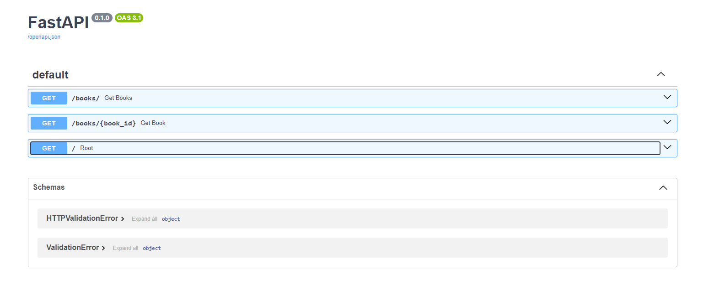
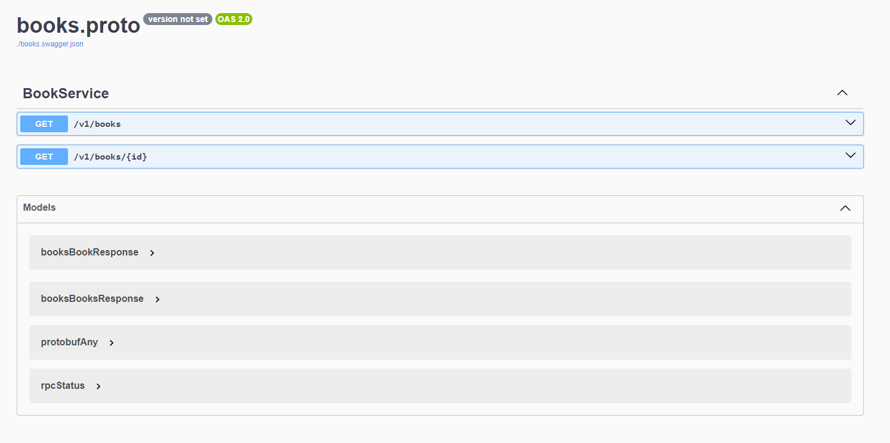

# Project - OO Systems Development

## Subject

The subject is free but rules are imposed:
- code at least two services communicating (one using the REST architecture, the
other the RPC architecture).
- Each service must have its own database (more than one type of database is
desirable : SQL, NoSQL…).
- Respect the rules given in the following project (to be adapted according to the
programming language): https://github.com/charroux/JavaCodingRules
- The services must be documented according to the Open API specification
(Swagger). Show screen shots in the Readme page oy your repository.
- Explain your project in the Readme page.
- The Rest service must be accessible via curl (give the list of the requests in the
Readme of your repository), or via a Javascript program (noted as a bonus) (give
screen shots in the Readme page) (separate the services from the Javascript)


## My project

This project is a Library. The REST API is directly connected to the database in PostgreSQL. The gRPC is connected to the REST API to fetch data from this one. All the project was done in Python.

## Run the project

#### Docker
1. In the terminal
```bash
docker compose up --build
```
2. Enjoy !


##  REST API - Library

This API is directly connected with the database.

- **FastAPI** : Framework for REST API in python
- **PostgreSQL** : Relational database for the library
- **Unittest**: Python's built-in unit testing framework.


###  Rest API Endpoints

1.   Get the list of books
```bash
curl http://localhost:8000/books/
```

2.   Get a book by the ID

```bash
curl http://localhost:8000/books/{book_id}
```

###  OpenAPI definition (Swagger)
```bash
http://localhost:8000/docs
```



###  Rest Test
```bash
python -m unittest discover -s services/REST/tests"
```


# gRPC API

This service communicates with REST API to get database information through REST API in **python** 



### gRPC API Endpoints

1. Get a book by ID (method: GetBook): The gRPC service makes a request to the REST API to fetch a book's details by its ID.
   
2. Get all books (method: GetAllBooks): This method retrieves the list of all books from the REST API.

